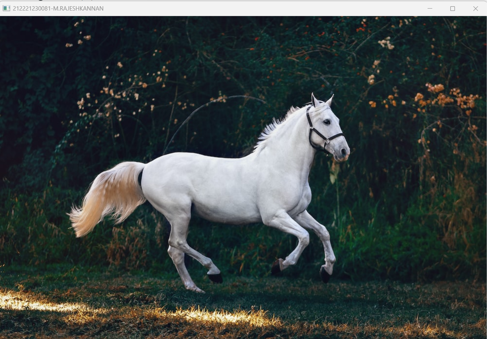
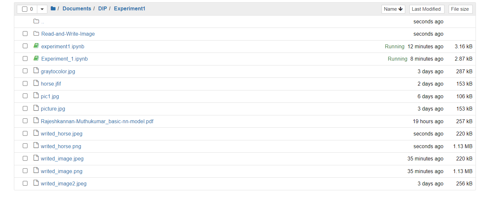
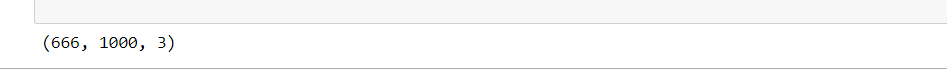
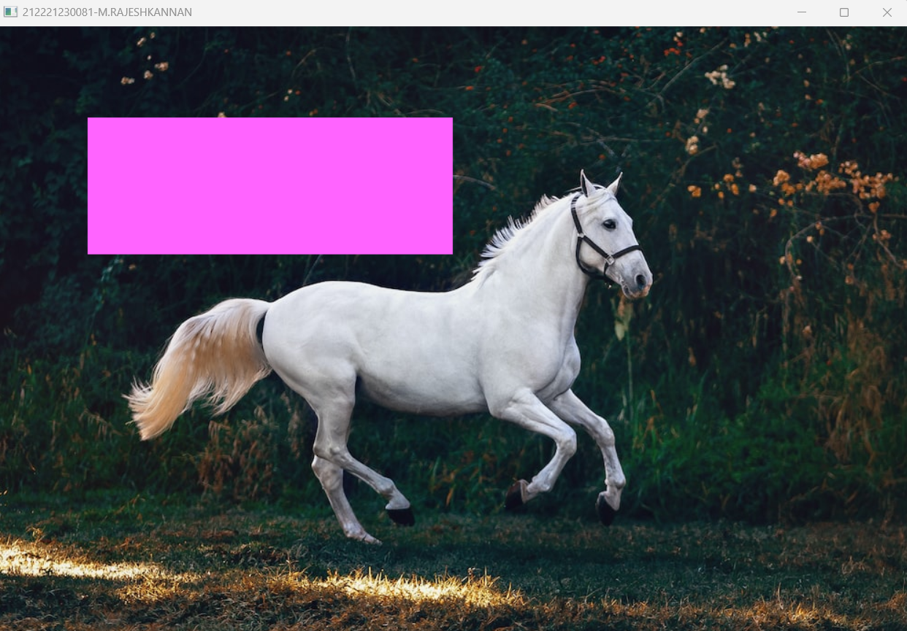

# READ AND WRITE AN IMAGE
## AIM
To write a python program using OpenCV to do the following image manipulations.

i) Read, display, and write an image.

ii) Access the rows and columns in an image.

iii) Cut and paste a small portion of the image.

## Software Required:
Anaconda - Python 3.7, Jupyter notebook
## Algorithm:
### Step1:
Choose an image and save it as a filename.jpg
### Step2:
Use imread(filename, flags) to read the file.
### Step3:
Use imshow(window_name, image) to display the image.
### Step4:
Use imwrite(filename, image) to write the image.
### Step5:
End the program and close the output image windows.
## Program:
```
 Developed By    : M.RAJESHKANNAN
 Register Number : 212221230081

```
i) To Read,display the image
```
import cv2
img=cv2.imread('horse.jfif',-1)
cv2.imshow('212221230081-M.RAJESHKANNAN',img)
cv2.waitKey()
cv2.destroyAllWindows()

```
ii) To write the image
```
import cv2
img=cv2.imread('horse.jfif',-1)
cv2.imwrite('writed_horse.png',img)
cv2.imwrite('writed_horse.jpeg',img)


```
iii) Find the shape of the Image
```
import cv2
img=cv2.imread('horse.jfif',-1)
print(img.shape)

```
iv)To access rows and columns

```
import cv2
img=cv2.imread('horse.jfif',-1)
for i in range(100,250):
    for j in range(100,500):
        img[i][j]=[255,100,255] #blue green red
cv2.imshow('212221230081-M.RAJESHKANNAN',img);
cv2.waitKey(0)
cv2.destroyAllWindows()
    


```
v) To copy and paste portion of image
```

import cv2
img1=cv2.imread('horse.jfif',-1)
copied_portion=img1[150:250,250:450]
img1[350:450,550:750]=copied_portion
cv2.imshow('212221230081-M.RAJESHKANNAN',img1)
cv2.waitKey(0)
cv2.destroyAllWindows()

```

## Output:

### i) Read and display the image


### ii)Write the image



### iii)Shape of the Image



### iv)Access rows and columns


### v)Cut and paste portion of image


## Result:
Thus the images are read, displayed, and written successfully using the python program.


